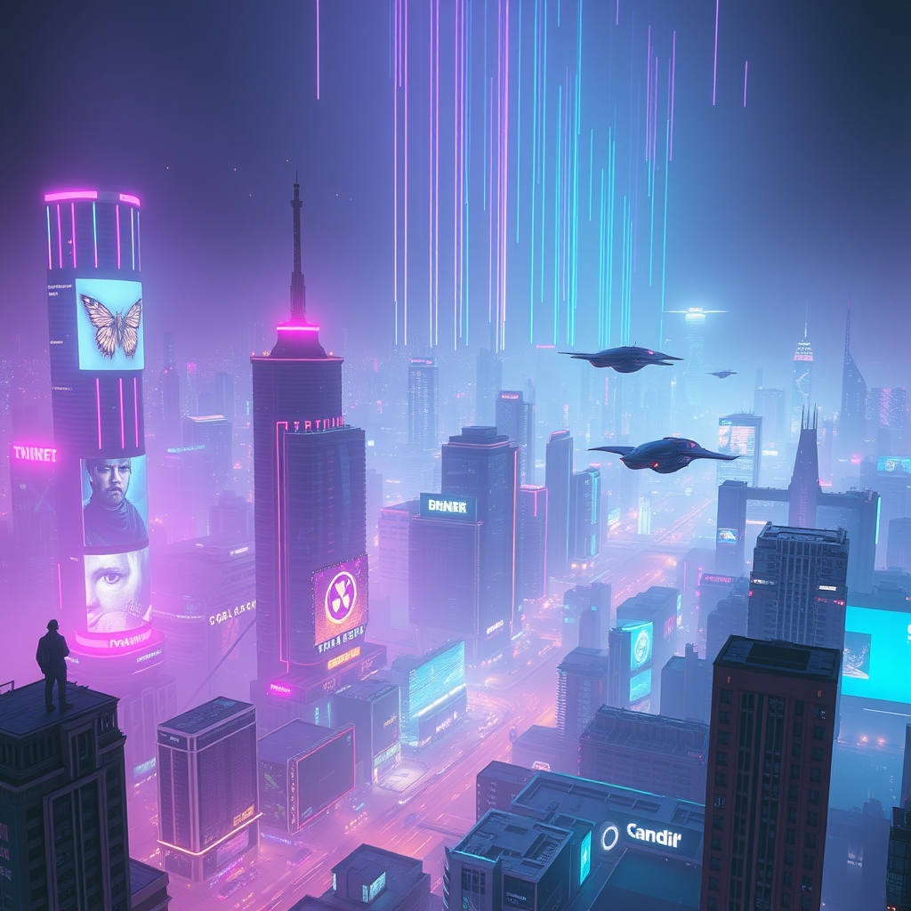

# LUMINA Labs - Scroll Animation Showcase

A cutting-edge scrolling animation website showcasing GSAP's advanced ScrollTrigger capabilities with a futuristic adaptive lighting product theme.

## Features

- **3D Orb Animation** - Interactive product visualization with 3D rotation
- **Horizontal Scrolling** - Multi-panel horizontal scroll section
- **Pinned Sections** - Sticky scroll-triggered experiences
- **Crossfade Transitions** - Smooth image transitions with scroll
- **Staggered Reveals** - Sequential element animations
- **Particle Systems** - Dynamic particle fields throughout
- **Counter Animations** - Animated numeric statistics

## Tech Stack

- GSAP 3.12.5 with ScrollTrigger, ScrollToPlugin, SplitText
- Tailwind CSS for styling
- Vanilla JavaScript

## Deploy

```bash
# Clone and serve locally
git clone https://github.com/FreakyFrancis/lumina-labs.git
cd lumina-labs
npx serve .
```

## Preview

